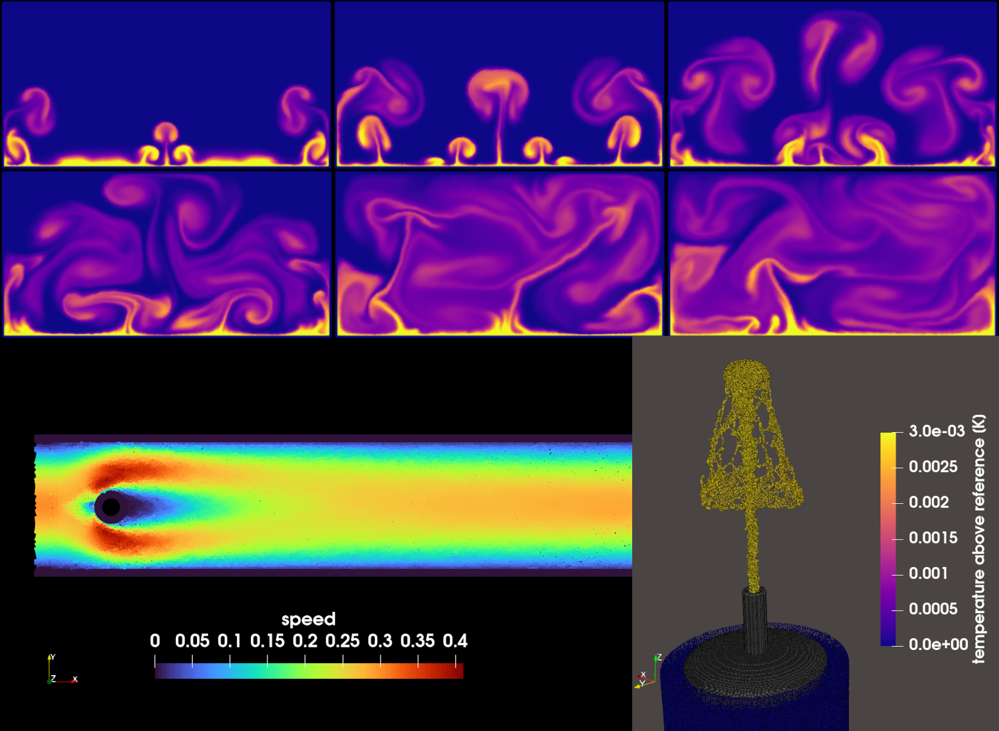

# SmoothedParticles.jl



Parallelized library for smoothed particle hydrodynamics (SPH) in 2d and 3d. Requires Julia 1.5 or newer. Cell-list optimized, flexible. Ideal for academia. Designed for experimenting with various SPH formulations. Both WCSPH and ISPH is supported. It creates files in pvd format for visualization in Paraview.

[Documentation](https://ondrejkincl.github.io/SmoothedParticles.jl/dev/index.html)

# Quick start
  
This package can be installed from Julia terminal using commands:
```
import Pkg
Pkg.add("SmoothedParticles")
```


For start, you can try to run dambreak simulation example. Follow these steps:

1: Clone, download or copy the folder [examples](https://github.com/OndrejKincl/SmoothedParticles.jl/tree/master/examples). 

2: Open Julia from the folder with command:

```
julia -t N
```

replacing `N` with number of cores that you wish to use in your simulation. 

3: Write:

```
include("collapse_dry.jl")
```

4: If this fails (of course it does) because package XY is missing, download it using 

```
import Pkg
Pkg.add("XY")
```

and repeat step 3.

5: Type

```
collapse_dry.main()
```

to run your simulation.

6: Wait for the simulation to end. Note that this can take several minutes. You should see info about time frames printed to the console. In the meantime, you can have delicious coffee or go outside.

7: Once it finishes, it creates a new file "results/collapse_dry/result.pvd" in the folder where the example was downloaded. Open it in [paraview](https://www.paraview.org/) to display the result. 


# Showing results in Paraview 

Open a .pvd file. The recommended display representation is **Point Gaussian**. It is also possible to use **SPH Volume Interpolator**. 

There are two ways how to plot **streamlines** of an SPH result in ParaView: 
1) use **SPH Volume Interpolator** and then choose **Surface LIC** representation (version 5.11+ or plugin)
2) use **Delaunay2D** filter and then **Stream Tracer** or **Evenly Spaced Streamlines**


# SPHKernels.jl

Quintic wendland kernels for 1d, 2d and 3d are implemented in this package. SmoothedParticles.jl is also compatible with kernels from [SPHKernels.jl](https://github.com/LudwigBoess/SPHKernels.jl) which offers a greater variety.
